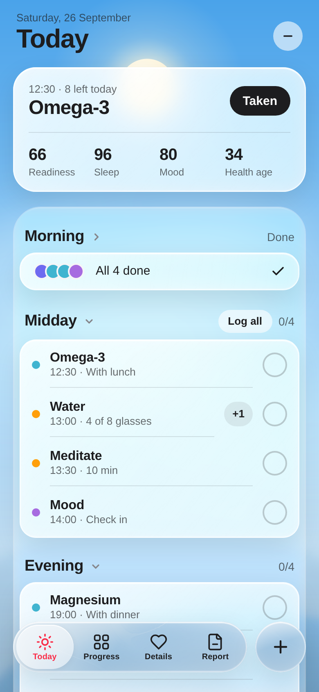
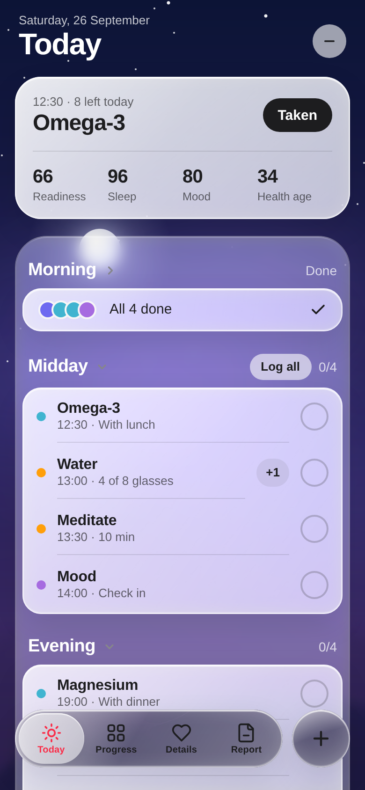
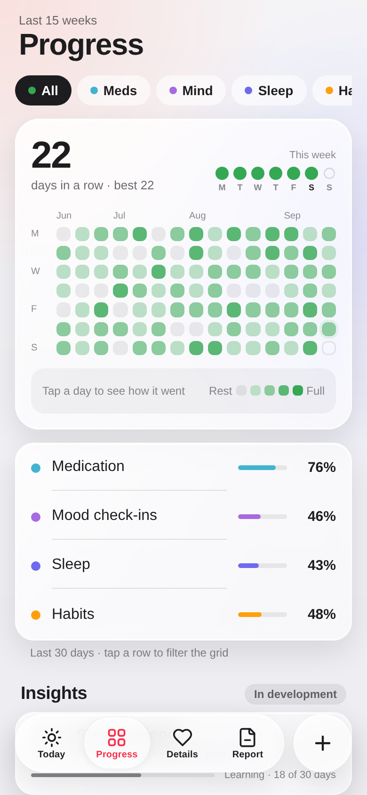
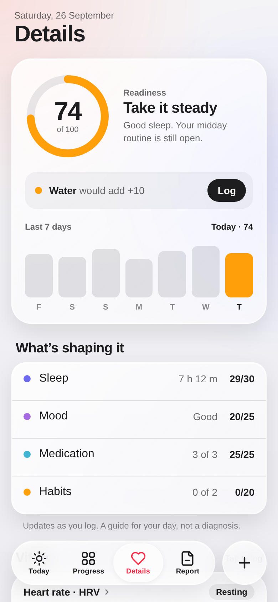
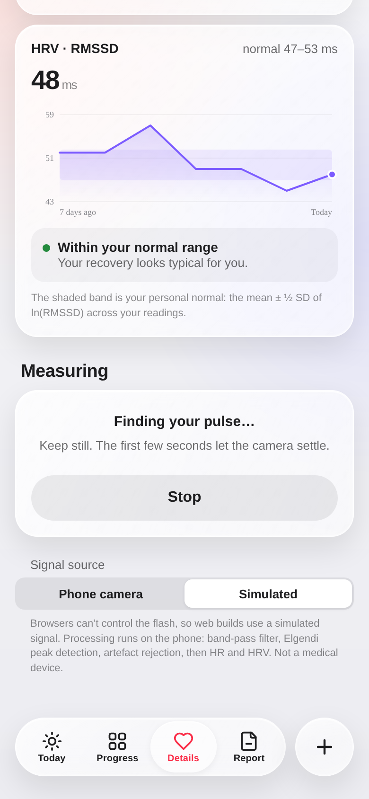
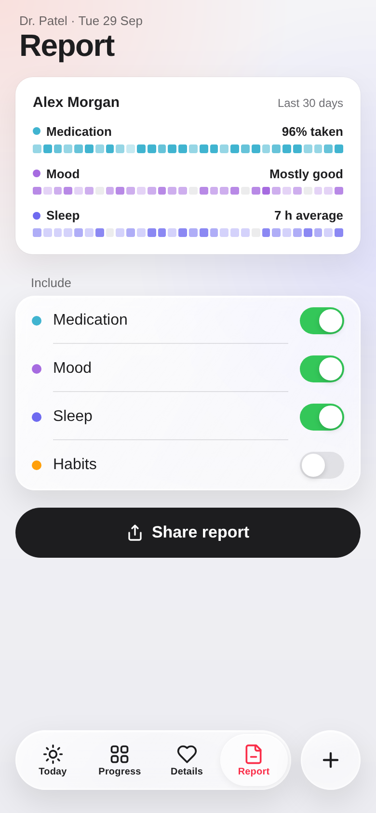

# Daily: health tracking with liquid glass

An Apple-style, minimal health app for medication, mood, sleep and habits, with fingertip heart-rate and HRV
measurement. It is built with **Expo (React Native)** for Android first, and also runs on iOS and the web.

The UI implements the Claude Design handoff *Health App v3*. The roadmap toward BP estimation, recovery and
predictive diagnostics is in [`docs/PLAN.md`](docs/PLAN.md).

| Today (day) | Today (night) | Progress | Details | Heart | Report |
|---|---|---|---|---|---|
|  |  |  |  |  |  |

## What's in Phase 1

- **Today**
  - One glass window holds the next item (one tap to log) and four scores: Readiness, Sleep, Mood and Health age.
  - The Morning, Midday and Evening lists sit on a frosted sheet. Swipe a row right to log it (a haptic tick marks the threshold), or tap the circle.
  - **Log all** logs every due midday item, and **+1** adds a glass of water. Finished sections fold away, and every log has **Undo**.
- **Wallpaper**
  - A day → night wallpaper on Today follows the real clock: sky gradient, sun and moon arcs, stars, drifting ribbons and a light sweep.
  - After dusk, text on the wallpaper turns white.
- **Progress**
  - A GitHub-style 15-week grid with filter chips. The colours sweep across week by week when you change filter.
  - Today's square breathes, and you can tap any day to see how it went.
  - Also: a count-up streak, the This week dots, per-area bars and the *Insights* rows marked "In development". Reserved slots keep the `analytics-*` IDs as `testID`s.
- **Details**
  - A readiness ring with a "what would lift it" suggestion, 7-day bars and a breakdown of what's shaping it.
  - The heart gauge and flame capsule. Hold the capsule to start a measurement.
  - The health age card and vitals rows.
- **Heart** (tap *Heart rate · HRV*)
  - Resting HR and HRV trends by week or month.
  - Your personal normal HRV band, with a plain-language read on it.
  - The live PPG waveform, an RR tachogram and a Poincaré plot with SD1/SD2.
  - A switch for the signal source.
- **Report**
  - The one-ball "sliced circle" animation, then a 30-day summary.
  - Include switches and a share sheet.
- **Sheets**
  - Quick log.
  - Mood check-in: a morphing orb on a slider, plus tags.
  - Vitals: "Same as last", press-and-hold ±, a tick ruler, and a save button that turns into a check.
  - Item details.
- **Minimise:** the – button shrinks the app into a glass widget with one progress bar per area.

## Heart rate and HRV: the signal pipeline (`src/signal`)

All processing runs on the phone. It follows NeuroKit2's (MIT) defaults, ported to TypeScript:

1. **Capture** (`camera/CameraPpgCapture.tsx`)
   - Uses the rear camera with the torch on. Your fingertip covers the lens and the flash.
   - Each frame's luma is averaged over the centre of the image, at ~30 fps.
   - An almost uniform frame means the lens is covered. The spatial variation doubles as a finger-contact detector.
   - Built on VisionCamera v5 frame processors.
2. **Resample and filter** (`filters.ts`)
   - Frames arrive with jittery timestamps, so the signal is resampled onto a uniform 60 Hz grid.
   - The camera signal is inverted: reflected light falls as blood volume rises.
   - A zero-phase Butterworth band-pass keeps 0.5–8 Hz.
3. **Peaks** (`peaks.ts`)
   - Elgendi et al. 2013 systolic peak detection.
   - Each peak is refined to sub-sample timing with **parabolic interpolation**. At 30 fps one frame is 33 ms, and without this RMSSD would be mostly quantisation noise.
4. **Beats → metrics** (`hrv.ts`)
   - Rejects out-of-range IBIs and ectopic beats (more than 20% from the local median).
   - Then computes HR, **RMSSD**, SDNN, pNN50 and Poincaré SD1/SD2.
5. **Quality** (`quality.ts`)
   - Template-matching SQI (Orphanidou et al. 2015). A poor signal isn't saved, and the app asks you to keep still.

A session lasts 60 s, the usual minimum for ultra-short RMSSD, after a 3 s warm-up.

**Accuracy on synthetic camera-like PPG**, from `__tests__/signal.test.ts` (30 fps, jittery frames, noise):
- HR stays within ±2 bpm at 50, 75 and 110 bpm.
- RMSSD stays within 2 ms of ground truth.
- Pure noise is flagged as poor.

These are **simulator results, not clinical validation.**

`HeartSource` (`sources.ts`) is the seam for other sensors. A BLE wearable with raw PPG (for example Polar Verity Sense) plugs in there.

## Liquid glass across Android versions

| Tier | Devices | Cards and sheets | Tab bar and + refraction |
|---|---|---|---|
| `live` | Android 12+ (API 31+, including Android 17), iOS, web | Real backdrop blur (`expo-blur`; RenderEffect-backed on Android), plus tint, specular edge and sheen | Skia: the wallpaper is re-rendered inside the bar through turbulence → displacement → blur |
| `frosted` | **Android 11** and older (API ≤ 30) | No live blur, because it's software-rendered and janky there. Instead a denser frosted fill with the same specular edge and sheen | Same Skia refraction. Skia draws on its own, so it works on Android 11 |

The tier is chosen once, in `src/ui/glass/capabilities.ts`. Every glass surface uses `<Glass>`
(`src/ui/glass/Glass.tsx`), and CSS `boxShadow` (RN 0.86) carries the design's inset highlights.

## Run it

```bash
npm install                # also copies CanvasKit to public/ for web
npx expo start --web       # quickest look (simulated heart signal)
npm test && npm run typecheck && npm run lint
```

**On your Android phone.** VisionCamera and Nitro are native modules, so Expo Go can't run this app. Use one of these:

- **Installable APK in the cloud (no Android Studio):**
  1. Run `npx eas-cli@latest build -p android --profile preview`.
  2. Open the link it prints on your phone and install the APK.
  3. The first run asks you to log in to a free Expo account.
- **Local:** with the Android SDK installed, run `npx expo run:android` while the phone is connected over USB.

## What is demo data

- The schedule, the 15-week history, the sleep figure and the report values are seeded from the design (`src/state/seed.ts`). Nothing is saved between launches yet.
- Readiness and **health age** use the design's placeholder weights. Health age in particular is **not** a validated model.
- The share actions (Send to Dr. Patel, PDF, link) only show a confirmation.
- Browsers can't control the flash, so web builds always use the simulated PPG source.

## On-device checklist (not verifiable in CI)

- [ ] Camera PPG on a real phone:
  - The torch turns on.
  - With a fingertip over the lens, the status goes from "no contact" to "running".
  - After 60 s, HR matches a pulse oximeter or watch to within about 3 bpm.
- [ ] Frame timestamps: confirm the unit inference in `CameraPpgCapture` (ns on Android, s on iOS).
- [ ] Android 11 (API 30 emulator is fine): the frosted tier renders, text stays legible, and scrolling is smooth.
- [ ] Android 12+ and Android 17: the live blur renders behind cards and sheets, and the tab bar shows refraction.
- [ ] Frame rate on Today: the Skia wallpaper runs at 60 fps on a mid-range phone.

## Health and safety

This is a personal research project, **not a medical device**. HR and HRV are wellness estimates.
Scores, health age and (in later phases) BP estimates and predictions are trends to discuss with a clinician,
not diagnoses. The planned experimental glucose feature stays behind a flag, is research-only and is never
included in reports (see `docs/PLAN.md`).

## Layout

```
src/app/            Expo Router entry (single route)
src/HealthApp.tsx   shell: backdrop, screens, tab bar, sheets, minimise
src/screens/        Today, Progress, Details, Heart, Report
src/sheets/         Quick log, Mood, Vital, Item, Share
src/components/     Wallpaper, TabBar (refraction), MinimisedWidget, Sheet/Toast
src/viz/            ReportOrb, FlameCapsule, MoodBlob (Skia); gauge and charts (SVG)
src/ui/             Glass tiers, Text/ink, controls, Slider, effects
src/state/          store (reducer + actions), selectors (pure ports of the design logic), seed data, heart session
src/signal/         PPG pipeline, sources, camera capture, measurement hook
__tests__/          signal accuracy + selector tests
docs/               PLAN.md (phases 1–4), screenshots
```
